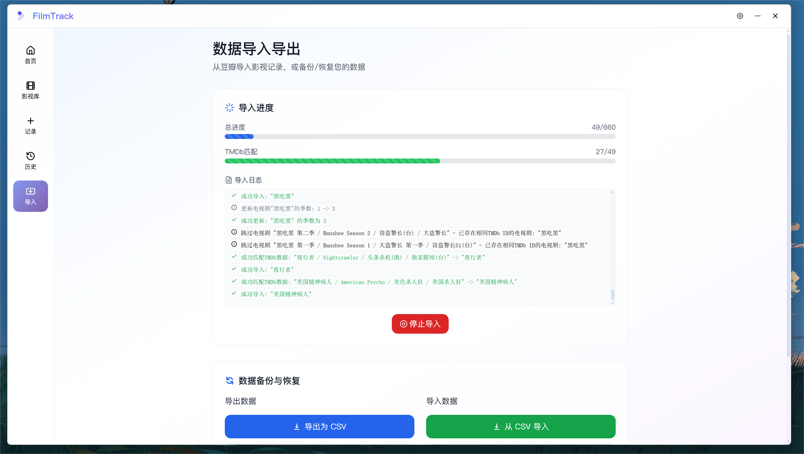
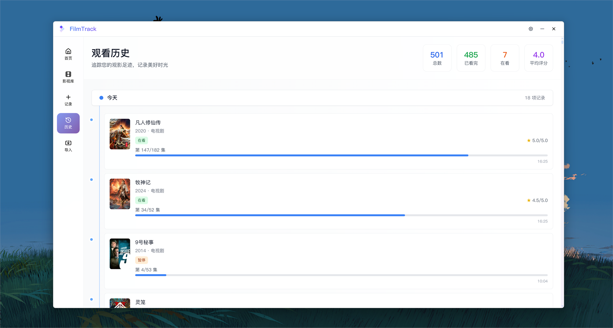

# 🎬 FilmTrackPro

<div align="center">


**个人影视管理平台 · 追踪你的观影足迹，记录每一段美好时光**

[](LICENSE)
[](https://tauri.app/)
[](https://vuejs.org/)
[](https://www.typescriptlang.org/)

[功能特性](#-功能特性) • [安装使用](#-安装使用) • [开发指南](#-开发指南)

</div>

## 📖 项目简介

FilmTrackPro（影迹 Pro）是一个基于 Tauri + Vue 3 开发的桌面应用程序，专为影视爱好者打造的个人观影进度管理平台。
它解决多平台观影的几个核心痛点：进度难以统一、常常忘记看到哪一集、观看源零散难找。影迹帮你精确记录每部作品的观看进度、片源、评分和笔记，还能在应用内直接匹配片源、切换线路在线观看，成为你观影路上的好帮手。

## ✨ 功能概览

### 影视记录

- 支持通过 TMDb 搜索电影和剧集，并补齐封面、简介、演员、导演、评分等信息
- 支持 `在看 / 已看 / 想看 / 暂停 / 弃坑` 等常用状态
- 支持电影评分、观看日期、观看平台、备注和个人短评
- 支持批量删除、标题搜索和影视库分类浏览

### 剧集进度

- 支持电视剧季集管理，记录当前季、当前集和总集数
- 详情页可直接继续标记下一集，跨季时会自动进入下一季
- 多季剧会同时维护当前季进度和累计观看进度
- 支持重刷记录，历史页会按真实观看日期分组展示

### 在线播放

- 详情页内置在线播放：自动为作品匹配可用片源，并整理出可播放的线路与剧集
- 支持在详情页手动切换片源 / 线路；当前线路失败时自动回退到下一条线路或片源，形成闭环
- 自动记忆并续播上次进度；设置里可配置默认片单、匹配策略与优先线路（设置只管默认，按影片的片源/线路在详情页切换）

### 首页与历史

- 首页提供总量、完成数、平均评分、本月观看、年度观看等统计
- 首页会自动整理“观影待办”和未来 7 天的更新提醒
- 历史页提供时间轴浏览，可按关键词、状态、类型和日期范围筛选
- 历史页顶部提供「观看活跃度热力图」，近一年的观看分布一目了然
- 历史展示优先使用真实观看时间，避免导入记录被错误归到当天

### 数据导入导出

- 支持从豆瓣导入个人条目，保留评分、观看时间、短评以及季数信息
- 导入时会尽量匹配 TMDb，并补齐海报、简介和季集资料
- 豆瓣导入支持跨页面保留进度和日志，切换页面后返回仍能继续查看
- 支持 `CSV / JSON` 导出与恢复，便于备份本地数据

### 桌面体验

- 使用本地 SQLite 数据库保存数据，不依赖云端服务
- 支持图片缓存、数据库空间查看和缓存清理
- 支持最小化到系统托盘、窗口尺寸记忆和手动检查更新
- 匿名使用统计可选开启，仅用于统计应用启动等匿名事件

## 🚀 技术亮点

### 📱 前端技术栈
- **Vue 3 + Composition API**：现代化的响应式框架
- **TypeScript**：完整的类型安全支持
- **Tailwind CSS**：实用优先的样式框架
- **Pinia**：轻量级状态管理
- **Vite**：极速的构建工具

### 🖥️ 桌面端技术
- **Tauri 2.0**：现代桌面应用框架
- **Rust**：高性能系统级编程语言
- **SQLite**：轻量级本地数据库
- **权限系统**：细粒度的安全权限控制

## 📸 界面预览

<div align="center">

### 🏠 首页

*首页集中展示统计卡片、观影待办、更新提醒和正在追剧列表。*

### 📚 个人影视库

*影视库支持按类型和状态浏览，也支持搜索和批量管理。*

### 📝 添加记录

*智能搜索和详细信息录入，支持TMDb数据自动填充*

### 🌐 豆瓣导入

*一键导入豆瓣观影记录，智能匹配TMDb数据并保留个人评分*

### 🎬 作品详情页

*详情页集中展示作品信息、季集进度、重刷记录和继续观看入口。*

### 📊 观影历史

*历史页按时间轴回看观影足迹，也能快速检索和筛选条目。*

</div>

## 💻 安装使用

### 快速开始

#### 方式一：下载发布版本（推荐）
1. 访问 [Releases 页面](https://github.com/yanstu/FilmTrackPro/releases)
2. 下载适合您系统的安装包
3. 运行安装程序并按提示操作

#### 方式二：从源码构建
```bash
# 克隆仓库
git clone https://github.com/yanstu/FilmTrackPro.git
cd FilmTrackPro

# 安装依赖（推荐使用 cnpm 或 yarn）
cnpm install
# 或
yarn install

# 开发模式运行
npm run tauri dev

# 构建发布版本
npm run tauri build
```

## 🛠 开发指南

### 项目结构

```
FilmTrackPro/
├── src/                    # 前端源码
│   ├── components/         # Vue 组件
│   │   ├── business/       # 业务组件
│   │   ├── common/         # 通用组件
│   │   └── ui/            # UI 组件
│   ├── views/             # 页面组件
│   ├── stores/            # Pinia 状态管理
│   ├── services/          # 业务服务
│   ├── utils/             # 工具函数
│   ├── composables/       # 组合式函数
│   └── types/             # TypeScript 类型定义
├── src-tauri/             # Tauri 后端
│   ├── src/               # Rust 源码
│   ├── capabilities/      # 权限配置
│   └── icons/             # 应用图标
├── config/                # 应用配置
└── docs/                  # 文档
```

## 🙏 致谢

感谢以下项目和服务：

- [TMDb](https://www.themoviedb.org/) - 提供优质的影视数据API
- [Tauri](https://tauri.app/) - 现代化的桌面应用框架
- [Vue.js](https://vuejs.org/) - 渐进式JavaScript框架
- [Tailwind CSS](https://tailwindcss.com/) - 实用优先的CSS框架
