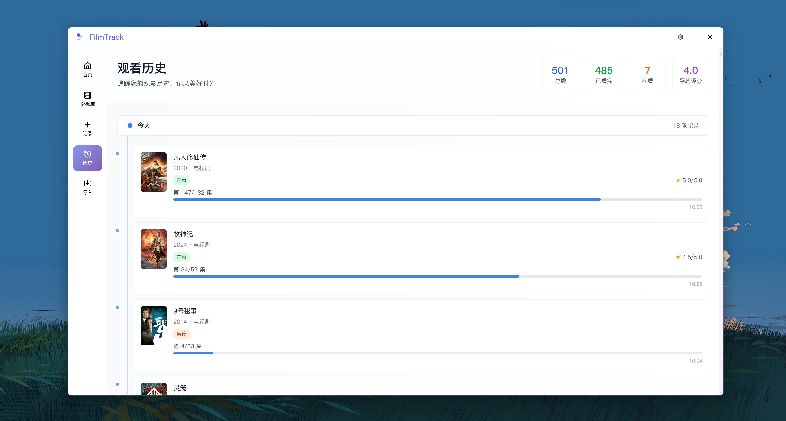

# 🎬 FilmTrack

<div align="center">


**个人影视管理平台 - 追踪您的观影足迹**

[](LICENSE)
[](https://tauri.app/)
[](https://vuejs.org/)
[](https://www.typescriptlang.org/)

[功能特性](#-功能特性) • [安装使用](#-安装使用) • [开发指南](#-开发指南)

</div>

## 📖 项目简介

FilmTrack（影迹）是一个基于 Tauri + Vue 3 开发的桌面应用程序，专为影视爱好者打造的个人观影进度管理平台。
它可以解决观众面临的核心痛点：在多平台观影时无法统一管理进度，常常忘记看到哪一集或观看源零散，看的时候又到处找。影迹都能帮您精确记录每部剧集的观看进度、记录播放源、个人评分和观影笔记，成为您观影旅程的忠实伴侣。

## ✨ 核心功能

### 🔍 智能搜索与发现
- **TMDb 集成**：接入全球最大的影视数据库
- **模糊搜索**：支持电影、电视剧智能搜索，包含拼音首字母匹配
- **实时建议**：输入时显示搜索建议，支持搜索结果高亮
- **详细信息**：演员、导演、剧情、评分等完整信息
- **高清海报**：支持图片缓存，提供流畅的离线浏览体验

### 📚 个人影视库管理
- **分类管理**：电影、电视剧分类浏览
- **状态追踪**：在看、已看、想看、暂停、弃坑五种状态
- **进度管理**：电视剧观看进度追踪，支持集数管理
- **个人评分**：5星评分系统，记录个人观影感受
- **无限滚动**：流畅的数据加载体验，支持大容量影视库
- **批量操作**：支持批量删除影视作品
- **高斯模糊界面**：现代化毛玻璃效果的用户界面

### 📊 数据统计与分析
- **观影统计**：总数、完成数、平均评分统计
- **时间轴视图**：观看历史时间线展示
- **趋势分析**：本月、本年观影数据统计
- **数据可视化**：直观的图表展示观影情况

### 🖥️ 桌面应用特性
- **无边框设计**：现代化的桌面应用界面
- **系统托盘**：最小化到系统托盘运行
- **离线缓存**：本地图片缓存，支持离线浏览
- **数据安全**：SQLite 本地数据库，确保数据隐私
- **跨平台**：支持 Windows
- **自动更新**：支持应用自动更新检查和安装
- **豆瓣导入**：支持从豆瓣导入个人观影记录和评分

## 🚀 技术亮点

### 📱 前端技术栈
- **Vue 3 + Composition API**：现代化的响应式框架
- **TypeScript**：完整的类型安全支持
- **Tailwind CSS**：实用优先的样式框架
- **Pinia**：轻量级状态管理
- **Vite**：极速的构建工具

### 🖥️ 桌面端技术
- **Tauri 2.0**：现代桌面应用框架
- **Rust**：高性能系统级编程语言
- **SQLite**：轻量级本地数据库
- **权限系统**：细粒度的安全权限控制

### 🎯 核心算法
- **模糊搜索算法**：支持拼音首字母和部分匹配
- **图片缓存系统**：双层缓存机制(文件+内存)
- **无限滚动**：性能优化的数据加载
- **状态同步**：实时的数据状态管理
- **豆瓣数据解析**：智能解析豆瓣页面数据和评分
- **标题匹配算法**：豆瓣标题与TMDb数据的智能匹配

## 📸 界面展示

<div align="center">

### 🏠 主页界面

*简洁的主页，展示影视库统计和最近添加的作品*

### 📚 个人影视库

*完整的个人影视库管理，支持分类浏览和状态筛选*

### 📝 添加记录

*智能搜索和详细信息录入，支持TMDb数据自动填充*

### 🌐 豆瓣导入

*一键导入豆瓣观影记录，智能匹配TMDb数据并保留个人评分*

### 🎬 作品详情页

*详细的影视作品信息展示，支持进度追踪和状态管理*

### 📊 观影历史

*时间轴展示观影历史，追踪您的观影足迹*

</div>

## 💻 安装使用

### 快速开始

#### 方式一：下载发布版本（推荐）
1. 访问 [Releases 页面](https://github.com/yanstu/filmtrack/releases)
2. 下载适合您系统的安装包
3. 运行安装程序并按提示操作

#### 方式二：从源码构建
```bash
# 克隆仓库
git clone https://github.com/yanstu/filmtrack.git
cd filmtrack

# 安装依赖（推荐使用 cnpm 或 yarn）
cnpm install
# 或
yarn install

# 开发模式运行
npm run tauri dev

# 构建发布版本
npm run tauri build
```

### 首次使用指南

1. **启动应用**：双击桌面图标或从开始菜单启动
2. **API 配置**：应用已预配置 TMDb API，开箱即用
3. **搜索影视**：点击"记录"开始搜索并添加您喜爱的影视作品
4. **数据管理**：在"库存"页面管理您的个人影视库
5. **状态追踪**：在详情页面更新观看状态和进度

## 🛠 开发指南

### 项目结构

```
filmtrack/
├── src/                    # 前端源码
│   ├── components/         # Vue 组件
│   │   ├── business/       # 业务组件
│   │   ├── common/         # 通用组件
│   │   └── ui/            # UI 组件
│   ├── views/             # 页面组件
│   ├── stores/            # Pinia 状态管理
│   ├── services/          # 业务服务
│   ├── utils/             # 工具函数
│   ├── composables/       # 组合式函数
│   └── types/             # TypeScript 类型定义
├── src-tauri/             # Tauri 后端
│   ├── src/               # Rust 源码
│   ├── capabilities/      # 权限配置
│   └── icons/             # 应用图标
├── config/                # 应用配置
└── docs/                  # 文档
```

## 🗺 发展路线图

### ✅ 已完成 (v0.2.0)

- [x] **豆瓣集成**：支持从豆瓣导入影视数据和评分
- [x] **自动更新系统**：支持应用自动更新检查和安装
- [x] **批量操作**：支持批量删除影视作品
- [x] **界面优化**：高斯模糊毛玻璃效果，现代化UI设计
- [x] **更新弹窗**：支持Markdown格式的更新说明显示
- [x] **数据导入导出**：支持 CSV/JSON 格式的数据备份

### 🌟 长期愿景 (v1.0.0)

- [ ] **移动端应用**：Android 伴侣应用
- [ ] **云端同步**：支持数据云端备份和同步

## 🙏 致谢

感谢以下项目和服务：

- [TMDb](https://www.themoviedb.org/) - 提供优质的影视数据API
- [Tauri](https://tauri.app/) - 现代化的桌面应用框架
- [Vue.js](https://vuejs.org/) - 渐进式JavaScript框架
- [Tailwind CSS](https://tailwindcss.com/) - 实用优先的CSS框架
